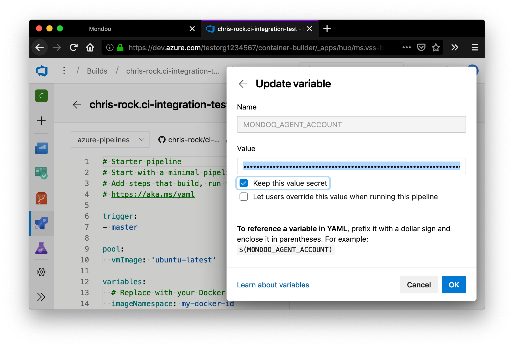
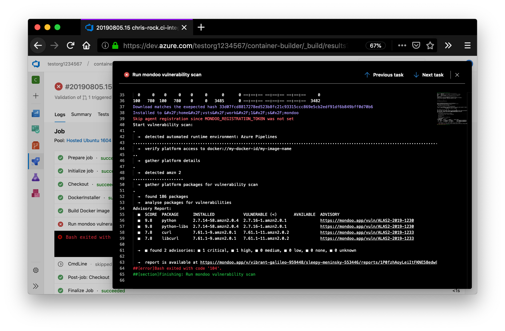

## Azure DevOps


To use Mondoo with Azure DevOps, you simply add another build step in `azure-pipelines.yml`. It is designed to block image push if vulnerabilities have been found. 

```
# Docker starter pipeline
#
# The script uses the following secrets:
# - dockerUser - Replace with your Docker ID for Docker Hub or the admin user name for the Azure Container Registry
# - dockerPassword - Password or Token
# - MONDOO_AGENT_ACCOUNT - Mondoo agent credentials

trigger:
- master

pool:
  vmImage: 'ubuntu-latest'

variables:
  # docker image namespace
  imageNamespace: my-docker-id
  # docker image name
  imageName: my-image-name


steps:
- task: DockerInstaller@0
  inputs:
    dockerVersion: '17.09.0-ce'

- script: |
    docker build -t $(imageNamespace)/$(imageName) .
  displayName: 'Build Docker image'

- script: |
    curl -sSL https://mondoo.io/download.sh | bash 
    echo ${MONDOO_AGENT_ACCOUNT} | base64 -d > mondoo.json
    ./mondoo scan -t docker://$(imageNamespace)/$(imageName) --config mondoo.json 
  displayName: 'Run mondoo vulnerability scan'
  env:
    MONDOO_AGENT_ACCOUNT: $(MONDOO_AGENT_ACCOUNT)

- script: |
    docker build -t $(imageNamespace)/$(imageName) .
    docker login -u $(dockerUser) -p $(pswd)
    docker push $(imageNamespace)/$(imageName)
  env:
    pswd: $(dockerPassword)
```

Additionally, you need to configure your build to store the credentials for the Mondoo agent in `MONDOO_AGENT_ACCOUNT`. You can [download the credentials](../../agent/installation/registration). For Azure, you need to encode the [credentials as base64](#store-mondoo-credentials). Next, you create a new `MONDOO_AGENT_ACCOUNT` [Azure secret](https://docs.microsoft.com/en-us/azure/devops/pipelines/process/variables?view=azure-devops&tabs=yaml%2Cbatch#secret-variables) and paste the content of the agent credentials:




Once configured, you can see the vulnerability report as part of the CI/CD job.

